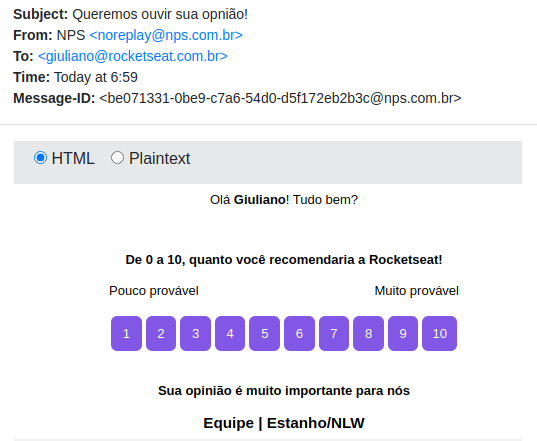

<h1 align="center">
  :rocket: Next Level Week 4.0 :rocket:
</h1>

  

  
  
  
  

  

---

## Projeto
O projeto tem como objetivo a criação de uma **API REST** que possibilita a criação de pesquisas de satisfação com cadastro de perguntas e utilização de um API para o envio de emails para os clientes, assim tendo como resultado uma métrica de lealdade do cliente (NPS).

O desenvolvimento ocorreu durante a Next Level Week da [Rocketseat](https://rocketseat.com.br/). :rocket:
 

---

- ## :mailbox_with_mail: Exemplo de e-mail

  

---
## Tecnologias

Esse projeto utilizou as seguintes tecnologias:

- [Node.js](https://nodejs.org/en/)
- [Express](https://expressjs.com/pt-br/)
- [Sqlite3](https://www.npmjs.com/package/sqlite3)
- [typeORM](https://typeorm.io/#/)
- [Jest](https://jestjs.io/)
- [Nodemailer](https://nodemailer.com/about/)

---
## Licença

[LICENSE](LICENSE) & [Rocketseat](https://rocketseat.com.br/)

---
:shipit: